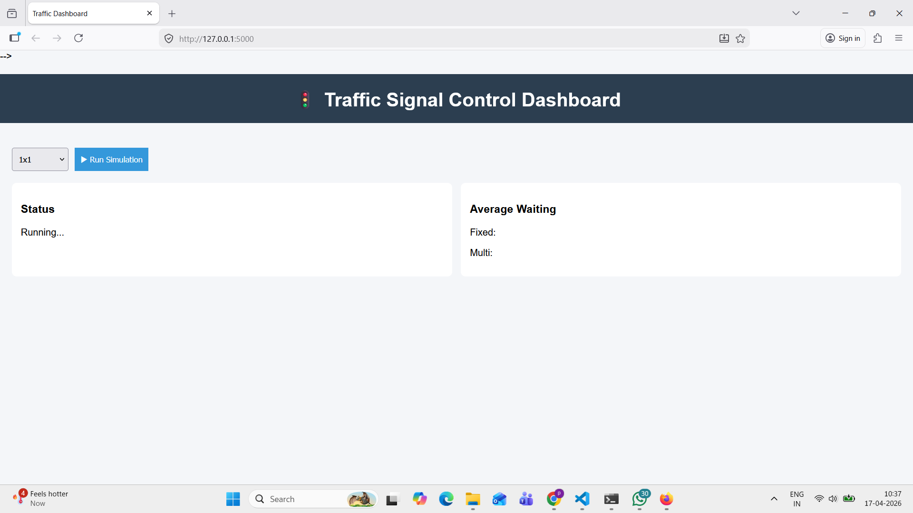
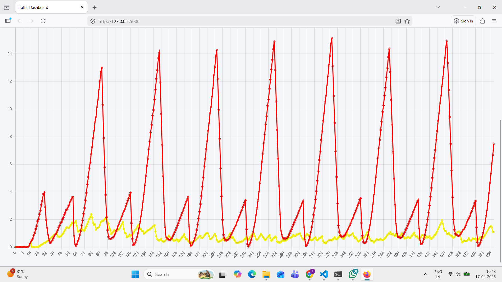

# 🚦 Intelligent Traffic Signal Control (SUMO + Flask)

A simulation-based system comparing **Fixed-Time** vs **Multi-Agent (Adaptive)** traffic signal control across:
- 1×1, 3×3, 4×4 grid networks
- Real-world road network (OpenStreetMap via SUMO)

## ✨ Features
- 🔁 Sequential evaluation: **Fixed → Multi**
- 🧠 Hybrid control:
  - **Grid networks** → queue-based coordination
  - **Real maps** → pressure-based control (incoming − outgoing)
- 📊 Web dashboard (Flask) with **waiting-time graphs**
- 🖥️ **SUMO-GUI** visualization for both runs

---

## 🧪 Demo

### Dashboard


### Comparison Graph

---

## ⚙️ Tech Stack
- Python, Flask
- SUMO (Simulation of Urban MObility)
- TraCI
- Chart.js

---

## 📁 Project Structure

traffic-signal-control/
├── app.py
├── requirements.txt
├── templates/
│ └── index.html
├── sumo_files/
│ ├── 1x1/
│ ├── 3x3/
│ ├── 4x4/
│ └── real_map/
└── assets/


---

## 🚀 Setup & Run

### 1) Install SUMO
- Download & install SUMO from official site
- Set environment variable:
  - **Windows**: `SUMO_HOME = C:\Program Files (x86)\Eclipse\Sumo`
  - **Linux/Mac**: export `SUMO_HOME=/path/to/sumo`

### 2) Install Python dependencies
```bash
pip install -r requirements.txt

3) Run the app
python app.py

Open:

http://127.0.0.1:5000

▶️ Workflow
Select grid: 1x1 / 3x3 / 4x4 / real
Click Run Simulation
SUMO GUI opens:
Fixed-time runs → closes
Multi-agent runs → closes
Dashboard shows graph + averages

📊 Metric
Average Waiting Time per vehicle (seconds) over simulation steps

🧠 Control Strategies
Fixed-Time
Alternating phases (NS/EW) with constant cycle
Multi-Agent (Adaptive)
Grid: queue-based + neighborhood coordination
Real map: pressure-based
pressure = incoming − outgoing
Minimum green time to avoid oscillations

📈 Result (Typical)
Network	Fixed	Multi
1x1	higher	lower
3x3	higher	lower
4x4	higher	lower
Real Map	higher	lower

🧑‍💻 Author
Virendra Patil, Deepak kumar

📜 License
MIT License